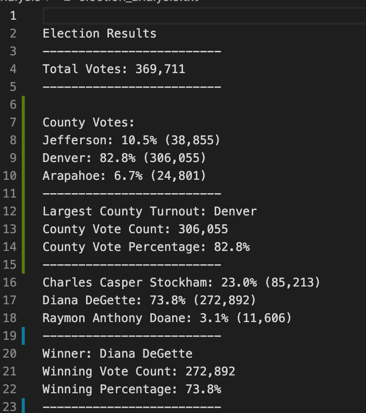
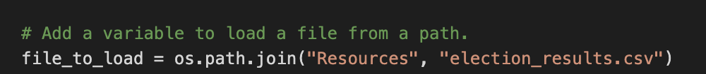
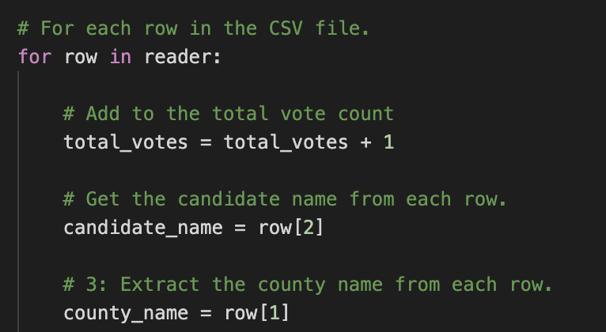

# Election_Analysis
Election analysis using python

## Overview
A Colorado Board of Elections employee has given you the following tasks to complete the election audit of a recent local congressional election.

1. Calculate the total number of votes cast.
2. Get a complete list of candidates who received votes.
3. Calculate the total number of votes each candidate received.
4. Calculate the percentage of votes each candidate won.
5. Determine the winner of the election based on popular vote.
6. Determine the voter turnout of each county
7. Calculate the percentage of votes from each county
8. Determine the county with highest turnout

All of the results will be written in the election_results.txt file.

## Resources
* Data Source: election_results.csv
* Software: Python 3.7, Visual Studio Code, 1.54.1

## Election Audit Results
The analysis of the election shows that:
1. Candidate Results
* There were total 369,711 votes cast in the election.
* The candidates were:
  * Charles Casper Stockham
  * Diana DeGette
  * Raymon Anthony Doane
* The candidate results were:
  * Charles Casper Stockham received 23.0% of the vote and 85,213 number of votes
  * Diana DeGette received 73.8% of the vote and 272,892 number of votes
  * Raymon Anthony Doane received 3.1% of the vote and 11,607 number of votes
* The winner of the election was:
  * Diana DeGette, who received 73.8% of the vote and 272,892 number of votes

2. County Results
* The county turnout and percentage of votes were:
  * Jefferson: 38,855 votes, and 10.5%
  * Denver: 306,055 votes, and 82.8%
  * Arapahoe: 24,801 votes, and 6.7%
* The county with highest turnout were:
  * Denver, who received 82.8% of total vote and 306,055 number of votes

\
Figure 1: the election results that writen in the txt file.

## Summary
In this project, we have created an excutable script to read election data from a csv file. To analysis data from other election, we can simply change our path to the reading file. 

\
Figure 2: the code for reading csv file.

In a new csv file, we nee dot determine the name of candidates and county to read. We need to look through the csv filed to determine the rows that contain our candidate name and county name. After we found the rows, we can read them as the code shows in figure 3.

\
Figure 3: the code for reading candidate name and county name.

